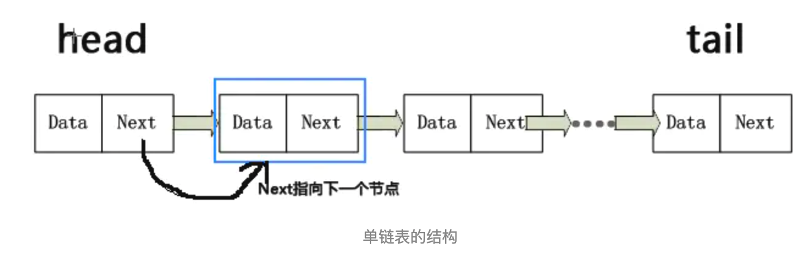

#### 	【data_algo 0】数组与链表

--------------------

* 线性表简介

  线性表是n个数据元素的**有限序列**

  实现方式一般有两种：

  - 数组 存储线性表的元素
  - 链表 存储

* 数组

  **固定大小**的数据结构。

  创建之后，大小不可变。

  如 java中 ArrayList的add方法，其实用了 Arrays.copyOf(e, newLength)

  ```java
  private Object[] grow(int minCapacity) {
    return elementData = Arrays.copyOf(elementData, newCapacity(minCapacity));
  }
  ```

* 链表

  链表是一种 物理存储单元上非连续、非顺序的存储结构。

  数据元素的逻辑顺序是通过指针链接实现的。

  

  ```java
  class Node<E>{
    E e;
    Node next;
    Node(E element){
      this.e = element;
      this.next = null;
    }
  }
  ```

  