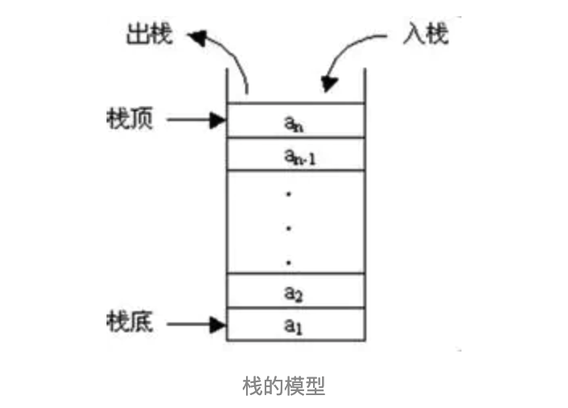
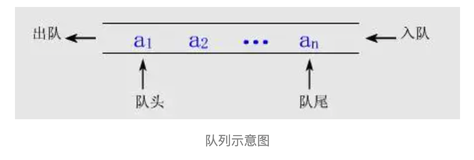

#### 【data_algo 1】栈与队列

------------

* 前言

  栈和队列，实际上是比较特殊的**线性表**

  对于栈来说，访问、插入、删除只能在栈顶进行

  对于队列来说，元素只能从队列尾插入，从队列头访问和删除

* 栈

  栈限制插入和删除只能在一个位置进行：

  所以也叫**LIFO表**，后进先出表。

  对于表尾的操作：

  push 入栈 pop 出栈 

  

* 队列

  队列也是种特殊的线性表

  

  它只允许在，前端进行删除操作。队头

  末端进行插入操作。队尾

  ```java
  public class MyQueue<E>{
    private LinkedList<E> list = new LinkedList<E>();
    
    // 入队
    public void enqueue(E e){
      list.addLast(e);
    }
    // 出队
    public E dequeue(){
      return list.removeFirst();
    }
  }
  ```

  

