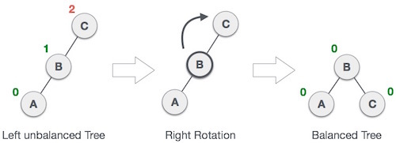
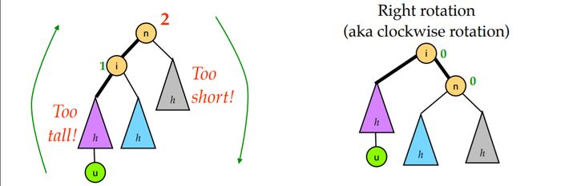
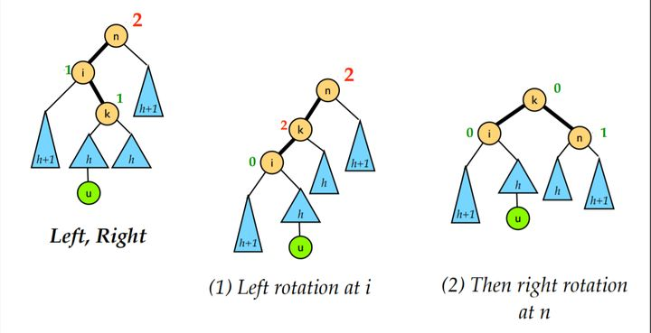
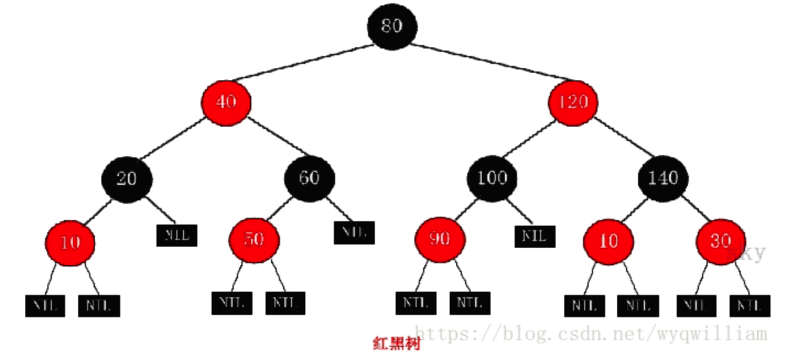

#### 【data_algo 2】树与二叉树

---------------

* 树

  树是**非线性数据结构**

  树 **是由n（n>=1）个有限节点组成一个具有层次关系的集合。**

  父节点，子节点。

* 基本二叉树

  最多有2个子树的数据结构。

  二叉树的种类：

  - 满二叉树

    节点已满，层数k，节点$2^k-1$

  - 完全二叉树

    层数k，除了第k层，其余节点已满

    且，第k层节点为左边连续，即都集中在左边连续节点。

  - 平衡二叉树 （AVL树）

    平衡因子（平衡度）：结点的平衡因子是结点的左子树的高度减去右子树的高度。（或反之定义）

    空树，或者左右子树的高度差不超过1

    并且左右子树也是平衡二叉树

    - 右旋

      

      LL型 -- 右旋平衡

      

    - 左旋

      

      RR型左旋平衡

      

    - LR型

      

    - RL型

      右旋 + 左旋。

  - 二叉查找树

    空树，或者左子树节点的值均小于根节点

    右子树节点的值均大于根节点。

  - 红黑树

    - 每个节点黑色或红色
    - 根节点黑色
    - 每个叶子节点(NIL)都是黑色
    - 红色节点的子节点必须黑色。
    - **从一个节点到该节点的所有NIL节点包含相同的黑色节点**

      

    红黑树是平衡二叉树的一种，它保证在最坏情况下基本动态集合操作的事件复杂度为$O(log n)$

    红黑树和平衡二叉树区别如下：

    -  **红黑树放弃了追求完全平衡**，追求大致平衡，在与平衡二叉树的时间复杂度相差不大的情况下，

      保证每次插入**最多只需要三次旋转就能达到平衡**，实现起来也更为简单。

    -  **平衡二叉树追求绝对平衡，条件比较苛刻，实现起来比较麻烦，每次插入新节点之后需要旋转的次数不能预知。**

* 二叉树的遍历方法

  - 先序遍历

    根 -> 左 -> 右

  - 中序遍历

    左 -> 根 -> 右

  - 后序遍历

    左-> 右 -> 根

    

* 二叉树的实现

  ```java
  class TreeNode<E>{
    E element;
    TreeNode<E> left;
    TreeNode<E> right;
    
    public TreeNode(E e){
      this.element = e;
    }
    
    protected void preorder(TreeNode<E> root) {
      if (root == null) return;
      System.out.println(root.element + " ");
      preorder(root.left);
      preorder(root.right);
  	}
  	protected void inorder(TreeNode<E> root) {
      if (root == null)
          return;
      inorder(root.left);
      System.out.println(root.element + " ");
      inorder(root.right);
  	}
    protected void postorder(TreeNode<E> root) {
      if (root == null)
          return;
      postorder(root.left);
      postorder(root.right);
  	  System.out.println(root.element + " ");
  	}
  }
  ```

* 二叉查找树的简单实现

  ```java
  /**
   * @author JackalTsc
   */
  public class MyBinSearchTree<E extends Comparable<E>> {
  
      // 根
      private TreeNode<E> root;
  
      // 默认构造函数
      public MyBinSearchTree() {
      }
  
      // 二叉查找树的搜索
      public boolean search(E e) {
  
          TreeNode<E> current = root;
  
          while (current != null) {
  
              if (e.compareTo(current.element) < 0) {
                  current = current.left;
              } else if (e.compareTo(current.element) > 0) {
                  current = current.right;
              } else {
                  return true;
              }
          }
  
          return false;
      }
  
      // 二叉查找树的插入
      public boolean insert(E e) {
  
          // 如果之前是空二叉树 插入的元素就作为根节点
          if (root == null) {
              root = createNewNode(e);
          } else {
              // 否则就从根节点开始遍历 直到找到合适的父节点
              TreeNode<E> parent = null;
              TreeNode<E> current = root;
              while (current != null) {
                  if (e.compareTo(current.element) < 0) {
                      parent = current;
                      current = current.left;
                  } else if (e.compareTo(current.element) > 0) {
                      parent = current;
                      current = current.right;
                  } else {
                      return false;
                  }
              }
              // 插入
              if (e.compareTo(parent.element) < 0) {
                  parent.left = createNewNode(e);
              } else {
                  parent.right = createNewNode(e);
              }
          }
          return true;
      }
  
      protected TreeNode<E> createNewNode(E e) {
          return new TreeNode(e);
      }
  
  }
  
  class TreeNode<E extends Comparable<E>> {
  
      E element;
      TreeNode<E> left;
      TreeNode<E> right;
  
      public TreeNode(E e) {
          element = e;
      }
  }
  ```