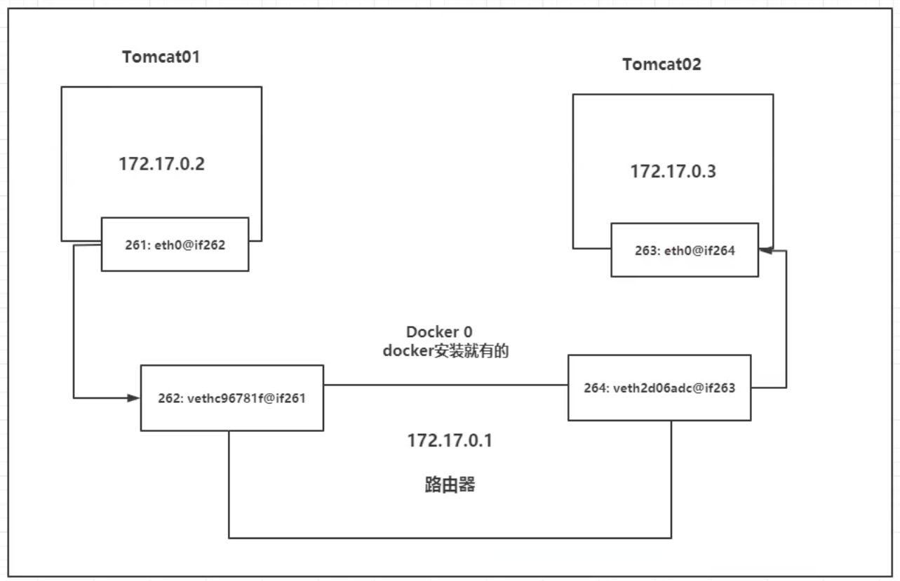

#### docker网络

--------------------

* 理解Docker0

  

  lo：回环地址

  261：dcoker分配的地址 172.18.0.2

  在linux上可以ping通, 172.18.0.2。

  linux可以ping通docker容器内部

  - 每启动一个docker容器，docker会给docker容器分配一个ip。

    只要安装了docker，就会有一个网卡docker0

    **桥接模式，使用的是evth-pair技术**

  - 每启动一个容器，将多出一对网卡

    

    

  - 容器带来的网卡都是一对对的：

    veth-pair技术，就是一对虚拟设备接口，他们都是成对出现的，一端连着协议，一端彼此相连。

    正因为有这个特性，一般使用veth-pair技术充当桥梁。

    专门用来连接虚拟网络设备。

    Openstack，Docker容器之间的连接，OVS的连接，都是使用的veth-pair技术。

  - 容器间可以互相ping通

    ```shell
    docker exec -it tomcat02 ping 172.18.0.2
    ```

    所有容器不指定网络的情况下都是由，docker0路由的。

    docker会给容器分配一个默认的可用ip

    

  - 小结：

    

    ​	Docker中所有的网络接口都是虚拟的，虚拟的转发效率高。

    ​	只要容器删除，对应的网桥就没有了。

- --link技术

  思考一个场景，编写了一个微服务，datatbase url=ip;

  项目不重启，只是数据库ip换掉了。

  --link

  ```shell
  # 使用服务名连接
  docker run -d -P --name tomcat03 --link tomcat02 tomcat
  
  # ping的时候写服务名 可以ping通
  docker exec -it tomcat03 ping tomcat02
  
  ```

  这种方式不推荐，有很多坑。

  比如：

  Tomcat02 ping不通 tomcat03

- 探究 --link 

  ```shell
  # 查看网络
  docker network ls 
  
  # 查看详细信息
  docker network inspect  id
  
  # 查看容器内网络配置
  docker exec -it tomcat03 at /etc/hosts
  
  ```

  --link 写死在容器内的hosts文件中

  