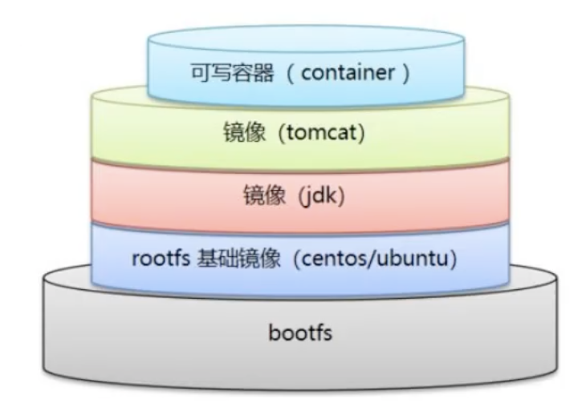

#### centos dockerfile制作

-----------

* dockhub中官方centos的dockerfile文件

  ```dockerfile
  FROM scratch
  ADD centos-7-x86_64-docker.tar.xz /
  
  LABEL \
      org.label-schema.schema-version="1.0" \
      org.label-schema.name="CentOS Base Image" \
      org.label-schema.vendor="CentOS" \
      org.label-schema.license="GPLv2" \
      org.label-schema.build-date="20201113" \
      org.opencontainers.image.title="CentOS Base Image" \
      org.opencontainers.image.vendor="CentOS" \
      org.opencontainers.image.licenses="GPL-2.0-only" \
      org.opencontainers.image.created="2020-11-13 00:00:00+00:00"
  
  CMD ["/bin/bash"]
  ```

  Docker hub中99%的镜像都是从 scratch来的，

  然后配置需要的软件和配置来进行构建

  

* 创建自己的centos

  

编写dockerfile：

```dockerfile
FROM centos
MAINTAINER zyw<278496680@qq.com>

ENV MYPATH /usr/local
WORKDIR $MYPATH

RUN yum -y install vim          # 添加yum
RUN yum -y install net-tools    # 添加net-tools

EXPOSE 80

CMD echo $MYPATH
CMD echo "------end-------"
CMD /bin/bash

```

```shell
docker run -it mycentos:0.1
# 可以看到自己制作的centos镜像中  添加上了  vim  、net-tools
```


- 查看dockerfile制作过程

  ```shell
  docker history d1a364dc548d
  
  IMAGE          CREATED       CREATED BY                                      SIZE      COMMENT
  d1a364dc548d   3 weeks ago   /bin/sh -c #(nop)  CMD ["nginx" "-g" "daemon…   0B        
  <missing>      3 weeks ago   /bin/sh -c #(nop)  STOPSIGNAL SIGQUIT           0B        
  <missing>      3 weeks ago   /bin/sh -c #(nop)  EXPOSE 80                    0B        
  <missing>      3 weeks ago   /bin/sh -c #(nop)  ENTRYPOINT ["/docker-entr…   0B        
  <missing>      3 weeks ago   /bin/sh -c #(nop) COPY file:09a214a3e07c919a…   4.61kB    
  <missing>      3 weeks ago   /bin/sh -c #(nop) COPY file:0fd5fca330dcd6a7…   1.04kB    
  <missing>      3 weeks ago   /bin/sh -c #(nop) COPY file:0b866ff3fc1ef5b0…   1.96kB    
  <missing>      3 weeks ago   /bin/sh -c #(nop) COPY file:65504f71f5855ca0…   1.2kB     
  <missing>      3 weeks ago   /bin/sh -c set -x     && addgroup --system -…   63.9MB    
  <missing>      3 weeks ago   /bin/sh -c #(nop)  ENV PKG_RELEASE=1~buster     0B        
  <missing>      3 weeks ago   /bin/sh -c #(nop)  ENV NJS_VERSION=0.5.3        0B        
  <missing>      3 weeks ago   /bin/sh -c #(nop)  ENV NGINX_VERSION=1.21.0     0B        
  <missing>      5 weeks ago   /bin/sh -c #(nop)  LABEL maintainer=NGINX Do…   0B        
  <missing>      5 weeks ago   /bin/sh -c #(nop)  CMD ["bash"]                 0B        
  <missing>      5 weeks ago   /bin/sh -c #(nop) ADD file:7362e0e50f30ff454…   69.3MB    
  zuoyiweideMacBook-Pro:local root# 
  
  ```

  