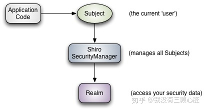

### 【0】shiro认知

----------

- 应用安全四大基石

  - 认证  Authentication
  - 授权  Authorization
  - 会话管理  Session Management
  - 加密  Cryptography

  shiro不维护用户、不维护权限。

  需要自己设计/提供，然后通过相应的接口注入给shiro。

- Shiro架构

  

  - Subject

    当前用户。可以是人，也可以是第三方服务、守护进程账户、时钟守护任务。

  - SecurityManager

    管理所有Subject，SecurityManager是Shiro架构的核心。

    配合内部安全组件共同组成安全伞。

  - Realms

    用于进行权限信息的验证。

    Realm本质上是一个特定的安全DAO：

    它封装与数据源连接的细节。

    得到Shiro所需的相关数据。

    在配置Shiro的时候，必须指定至少一个Realm来实现认证、授权。

- 实例

  ```java
  import org.apache.shiro.SecurityUtils;
  import org.apache.shiro.authc.UsernamePasswordToken;
  import org.apache.shiro.mgt.DefaultSecurityManager;
  import org.apache.shiro.realm.SimpleAccountRealm;
  import org.apache.shiro.subject.Subject;
  import org.junit.Before;
  import org.junit.Test;
  
  public class AuthenticationTest {
  
      SimpleAccountRealm simpleAccountRealm = new SimpleAccountRealm();
  
      @Before // 在方法开始前添加一个用户
      public void addUser() {
          simpleAccountRealm.addAccount("wmyskxz", "123456");
      }
  
      @Test
      public void testAuthentication() {
  
          // 1.构建SecurityManager环境
          DefaultSecurityManager defaultSecurityManager = new DefaultSecurityManager();
          defaultSecurityManager.setRealm(simpleAccountRealm);
  
          // 2.主体提交认证请求
          SecurityUtils.setSecurityManager(defaultSecurityManager); // 设置SecurityManager环境
          Subject subject = SecurityUtils.getSubject(); // 获取当前主体
  
          UsernamePasswordToken token = new UsernamePasswordToken("wmyskxz", "123456");
          subject.login(token); // 登录
  
          // subject.isAuthenticated()方法返回一个boolean值,用于判断用户是否认证成功
          System.out.println("isAuthenticated:" + subject.isAuthenticated()); // 输出true
  
          subject.logout(); // 登出
  
          System.out.println("isAuthenticated:" + subject.isAuthenticated()); // 输出false
      }
  }
  ```

  - 过程

    realm -> securityManager -> SecuritryUtils  ->Subject

    