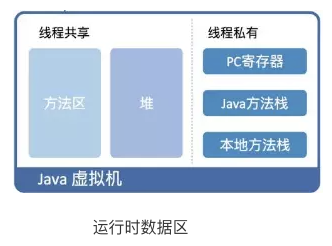

#### 【3】类加载内存分析和初始化

------------

- 内存概述

  

  

  - 堆

    存放new的对象和数组

    可被所有线程共享，不会存放对象的引用

  - 栈

    存放基本类型

    引用对象的变量

  - 方法区

    可被所有线程共享

    包含了所有class和static变量

- 类加载过程

  ```mermaid
  graph LR
  a[类加载 Load]
  b[类的链接 Link]
  c[类的初始化 Init]
  
  a --> b
  b --> c
  ```

  - 类加载

    将类的class文件读入内存，并为之创建一个java.lang.Class对象。

  - 类的链接

    将类的二进制数据合并到JRE。

    - 验证：确保加载的类信息符合JVM规范。
    - 准备：正式为类变量static分配内存，并设置类变量默认初始值阶段。
    - 解析：虚拟机常量池的符号信用替换为直接饮用的过程

  - 类的初始化

    JVM负责堆类进行初始化

    - 执行类构造器`<clint>()`方法的过程。

      类构造器`<clint>()`方法是由编译器自动收集类中所有类变量的赋值动作和静态代码块中的语句产生的。

      类构造器是构造类信息的。不是构造该类的对象的构造器。

    - 初始化一个类的时候，优先初始化父类的初始化。

    - 虚拟机会保证一个类的`<clint>()`方法在多线程环境中被正确枷锁和同步。

- 类的主动引用（一定会发生类的初始化）
  -  虚拟机启动，初始化main方法所在类
  - new一个类的对象
  - 调用类的静态成员和静态方法。
  - 使用java.lang.reflect包的方法对类进行反射调用。
  - 初始化一个类，如果其父类没有被初始化，则先会初始化它的父类。
  
- 类的被动引用（不会发生类的初始化）
  - 访问一个静态域，只有真正声明这个域的类才会被初始化。（如，通过子类引用父类的静态变量，不会导致子类初始化，父类会）
  - 通过数组定义类引用。
  - 引用常量不会发生此类的初始化（常量在链接阶段就存入调用类的常量池了）

