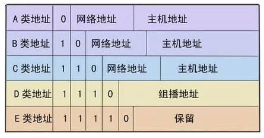

#### 【0】计算机网络基础知识

------------

- 网络模型

  

- 网络编程

  针对的是 传输层（TCP/UDP）

- 网络编程主要问题：

  - 如何准确定位到网络上的一台或者多台主机
  - 找到主机之后如何进行通信

- 网络编程中的要素

  - IP和端口号
  - 网络通信协议
  
- IP地址

  - 127.0.0.1  本机地址

  - Ipv4/ipv6

    - Ipv4，4个字节组成，42亿，2011年用尽
    - Ipv6，128位，8个2字节表示，冒号分割

  - 公网（互联网）私网（局域网）

    

    - A类地址

      每个网络支持$2^{24}-2$台，约16million多

      范围：1.0.0.0 - 126.255.255.255

      

      掩码：255.0.0.0

      其中，

      - 10.0.0.0 - 10.255.255.255是私有地址（大公司搭网）。

      - 127.0.0.1 - 127.255.255.255 是保留地址，用作循环测试用。

    - B类地址

      每个网络支持$2^{16}-2$台，65536台 128

      范围：128.0.0.0 - 191.255.255.255

      掩码：255.255.0.0

      其中，

      - 172.16.0.0 - 172.31.255.255     是私有地址（局域网）

      - 169.254.0.0 - 169.254.255.255 是保留地址（如果电脑IP地址是自动获取，将自动分配其中一个IP）

    - C类地址  

      每个网络支持$2^8-2$台，254台

      范围：192.0.0.0 - 223.255.255.255   128+64=192

      掩码：255.255.255.0

      其中，

      - 192.168.0.0 - 192.168.255.255 是私有地址（局域网）

    - D类地址

      无掩码

      范围：224.0.0.0 - 239.255.255.255  128+64+32=224

      用于多点播送

      IPV6中，第一个字节为0XFF

      - 专用地址：224.0.0.0 -224.0.0.255  网络协议组的广播

      - 公用地址：224.0.1.0 - 238.255.255.255  用于其它组播

      - 私有地址：239.0.0.0 -239.255.255.255 用于测试

    - E类地址

      无掩码

      E类地址保留，仅作为搜索、internet实验和开发用

      范围：240.0.0.0 - 255.255.255.255

      全0  表示当前主机

      全1 表示当前子网的广播地址