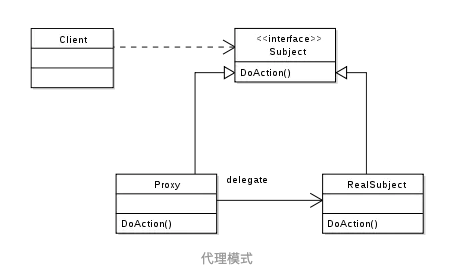

#### 【6】代理模式

--------------------------------

* 主体思想

  代理类为委托类提供消息预处理，消息转发，事后消息处理等功能。

  代理分为三种角色：

  1. 代理类  ProxySubject
  2. 委托类  RealSubject
  3. 接口 interface

  如下图：

  

  **根据代理类生成的时机不同**，分为**静态代理**和**动态代理**

  - 静态代理 在编译时  已经确定

  - 动态代理 则是 在JVM运行时动态生成

* 静态代理

  **静态代理要求 proxy和real 都实现同一接口**

  即代理类和委托类 都需要实现同一接口的同一方法。

* 动态代理

  **动态代理依靠反射实现**

  主要涉及：

  - `java.lang.reflect.Proxy`
  - `java.lang.reflect.InvocationHandler`

  代理类需要实现`InvocationHandler`接口或者创建匿名内部类

  Proxy则用于创建动态代理

  ```java
  class HelloServiceDynamicProxy {
      private HelloService helloService;
      public HelloServiceDynamicProxy(HelloService helloService) {
          this.helloService = helloService;
      }
  
      public Object getProxyInstance() {
          return Proxy.newProxyInstance(
            helloService.getClass().getClassLoader(), 
            helloService.getClass().getInterfaces(), 
            new InvocationHandler() {
              @Override
              public Object invoke(Object proxy, Method method, Object[] args) throws Throwable {
                  System.out.println("Before say hello...");
                  Object ret = method.invoke(helloService, args);
                  System.out.println("After say hello...");
                  return ret;
              }
            }
         	);
      }
  }
  
  // 测试类
  public class HelloServieDynamicProxyTest {
      public static void main(String[] args){
          HelloService helloService = new HelloServiceImpl();
          HelloService dynamicProxy = (HelloService) new HelloServiceDynamicProxy(helloService).
            getProxyInstance();
          dynamicProxy.sayHello();
      }
  }
  ```

