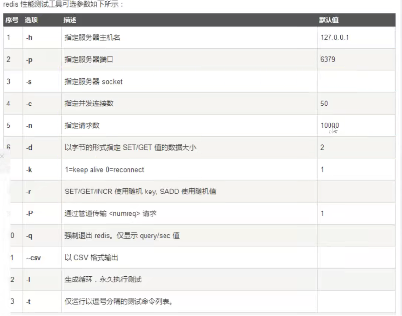

### Redis入门

-------------

#### 1. 简介

- Redis是什么

  **Remote  Dictionary Server，远程字典服务**

  - 开源C编写的数据库

  - 基于内存，但亦可持久化。

  - KV数据库
  - 提供多种语言的API
  - 也称为结构化数据库

- Redis能干什么

  - 内存存储、持久化，内存中是断电即失的，持久化很重要（rdb，aof）
  - 效率高，可以用于告诉缓存
  - 简单的发布订阅系统
  - 地图信息分析
  - 计时器、计数器（浏览量）
  - ....

- Redis特性

  - 多样的数据类型
  - 持久化
  - 集群
  - 事务

  - ...

--------

#### 2. Redis安装使用

- 安装

  - 官网下载安装（使用包管理器也可）

- 使用

  - 修改redis.conf 中daemonize  改为yes
  - redis-server redis.conf

  - bin目录下，`redis-cli`

  - **默认端口：6379**

- 基本命令

  ```bash
  redis-cli
  >>ping
  PONG   // 表示连通
  >> set name zyw
  OK
  >> get  name
  "zyw"
  ```

- redis-benchmark心梗测试工具

  

  简单测试一下

  ```bash
  redis-benchmark -h localhost -p 6379 -c 100 -n 100000
  ```

---------------

#### 3. Redis基础知识

- 基础知识

  - redis默认16个数据库

    ```shell
    select 3 # 切换数据库
    DBSIZE
    ```

  - key

    ```bash
    keys *   ## 查看所有key
    flushdb   # 清楚库所有
    flushall  # 清楚所有数据库
    exists key # 判断是否存在某个key
    move key   # 删除某个key
    exipre key 10  # 设置某个key 10s过期
    ttl name # 查看还剩多少秒过期
    ```

  - Redis是单线程的

    redis是很快的，官方表示，redis是基于内存操作的，cpu不是redis性能瓶颈。

    Redis的瓶颈是根据机器的内存和网络带宽。

    所以就是用单线程。

  - 为甚Redis是单线程这么快

    Redis是C语言写的，官方提供数据为100000+QPS，完全不必同样使用kv的memcache差。

    **Redis是将所有的数据全部放在内存中的，所以使用单线程去操作就是最高的**

    多线程（CPU上下文切换，耗时）。

    多次读写都是在一个CPU上的，在内存情况下，单线程就是效率最高的。