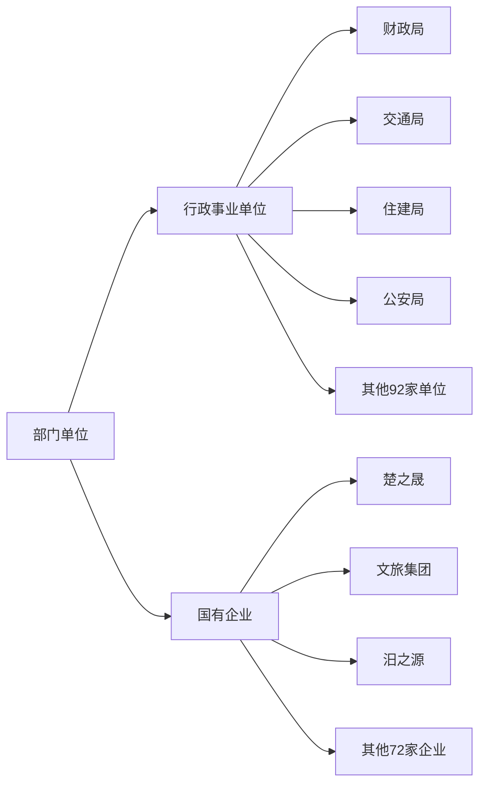

#### 【0】项目需求结构

------------

- 部门单位结构图



- 资产管理结构图

  ```mermaid
  graph LR
  A[资产管理]
  B1[经营性资产]
  B11[经营性门面<br>原经营性门面管理<br>opreation_shop_details]
  B12[闲置经营性门面管理<br>idle_shop_details]
  B13[固定资产<br>原资产管理<br>totalasset]
  B2[资产处置]
  B21[报废资产]
  B22[核销资产]
  B23[资产划拨]
  A --> B1 
  B1 -->  B11
  B1 -->  B12
  B1 -->  B13
  A --> B2
  B2 --> B21
  B2 --> B22
  B2 --> B23
  ```

  闲置经营性门面管理  idle_shop_details

  部门表：

- 资产处置：

  审核表，功能：
  
  审批
  
  三表汇总，  功能： 报废、核销、划拨
  
  ```sql
  ```
  
  


