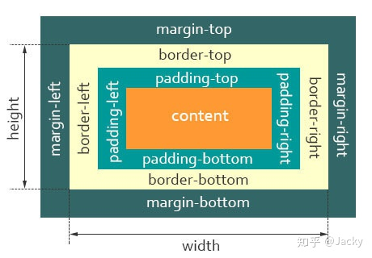

### 【1】CSS盒模型

--------

- 盒模型是什么

  content、padding、border、margin

  内容、内填充、边框、边距

  content才是html元素

  

- 盒模型分类

  - W3C标准盒模型（标准盒模型）

    

    **width = content-width**

    设置：

    **box-sizing:content-box**

  - IE盒子模型（怪异盒模型）

    

    **width = content-width + padding-width + border-width**

    设置：

    **box-sizing:border-box**

- 外边距合并

  **块级元素，有时候，顶底外边距只会算一边的。**

  - 上下相邻块级元素

    如：上下两个div，中间 margin只会算大的一边的，并不是相加。

  - 父子元素

    具备BFC特性的块级元素

    不存在上边框、上内补、inline content、清除浮动这四个属性。

    那么，第一个子元素和父元素，顶部的外边距会取最大值。

- **BFC**

  Block formating Context

  看做是隔离的容器。容器内部元素布局不会影响到外面。

  **触发 BFC：**

  - body 根元素
  - 浮动元素：float 除 none 以外的值
  - 绝对定位元素：position (absolute、fixed)
  - display 为 inline-block、table-cells、flex
  - overflow 除了 visible 以外的值 (hidden、auto、scroll)

  **BFC 的用途：**

  - 清除浮动
  - 解决外边距合并
  - 布局

