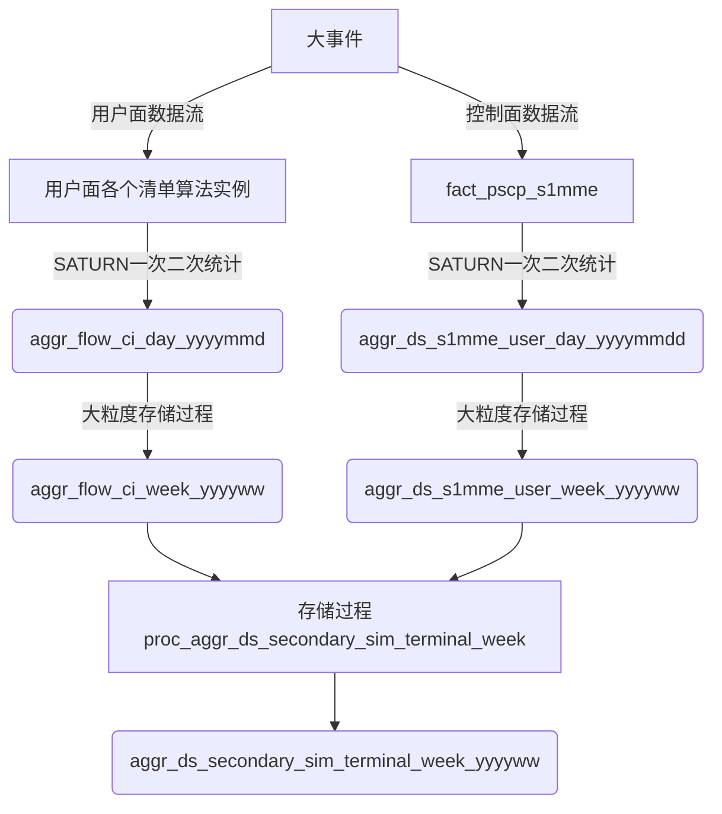
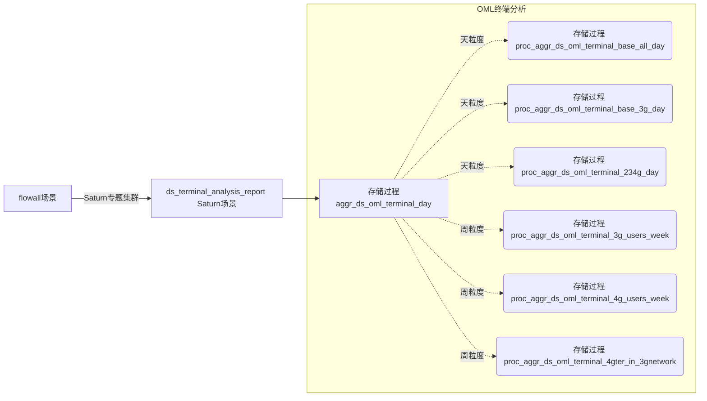
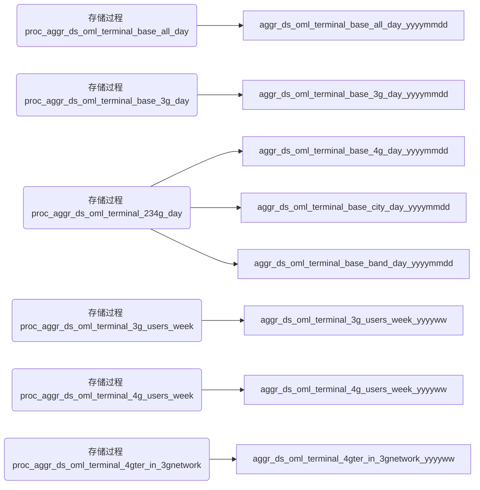

test

-----------------------

```mermaid
graph TD
A[大事件] -->|用户面数据流| B1[用户面各个清单算法实例]
A -->|控制面数据流| C1[fact_pscp_s1mme]
B1 -->|SATURN一次二次统计| B2(aggr_flow_ci_day_yyyymmd)
C1 -->|SATURN一次二次统计| C2(aggr_ds_s1mme_user_day_yyyymmdd)
B2 -->|大粒度存储过程| B3(aggr_flow_ci_week_yyyyww)
C2 -->|大粒度存储过程| C3(aggr_ds_s1mme_user_week_yyyyww)
B3 --> D[存储过程proc_aggr_ds_secondary_sim_terminal_week]
C3 --> D
D --> E(aggr_ds_secondary_sim_terminal_week_yyyyww)
```

* OML终端分析

```mermaid
graph LR
B[flowall场景]
B --Saturn专题集群--> B1[ds_terminal_analysis_report Saturn场景]
B1 --> C[存储过程aggr_ds_oml_terminal_day]
subgraph OML终端分析
C -.天粒度.-> D1(存储过程 proc_aggr_ds_oml_terminal_base_all_day)
C -.天粒度.-> D2(存储过程 proc_aggr_ds_oml_terminal_base_3g_day)
C -.天粒度.-> D3(存储过程 proc_aggr_ds_oml_terminal_234g_day)
C -.周粒度.-> D4(存储过程 proc_aggr_ds_oml_terminal_3g_users_week)
C -.周粒度.-> D5(存储过程 proc_aggr_ds_oml_terminal_4g_users_week)
C -.周粒度.-> D6(存储过程 proc_aggr_ds_oml_terminal_4gter_in_3gnetwork)
end
```

```mermaid
graph LR
A(存储过程 proc_aggr_ds_oml_terminal_base_all_day) --> A1[aggr_ds_oml_terminal_base_all_day_yyyymmdd]
B(存储过程 proc_aggr_ds_oml_terminal_base_3g_day)  --> B1[ aggr_ds_oml_terminal_base_3g_day_yyyymmdd] 
C(存储过程 proc_aggr_ds_oml_terminal_234g_day) --> C1[aggr_ds_oml_terminal_base_4g_day_yyyymmdd]
C --> C2[aggr_ds_oml_terminal_base_city_day_yyyymmdd]
C --> C3[aggr_ds_oml_terminal_base_band_day_yyyymmdd]
D(存储过程 proc_aggr_ds_oml_terminal_3g_users_week) --> D1[aggr_ds_oml_terminal_3g_users_week_yyyyww]
E(存储过程 proc_aggr_ds_oml_terminal_4g_users_week) --> E1[aggr_ds_oml_terminal_4g_users_week_yyyyww]
F(存储过程 proc_aggr_ds_oml_terminal_4gter_in_3gnetwork) --> F1[aggr_ds_oml_terminal_4gter_in_3gnetwork_yyyyww]
```

