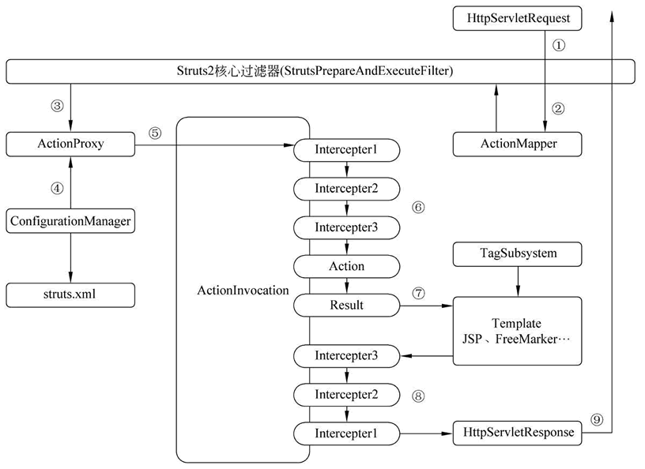
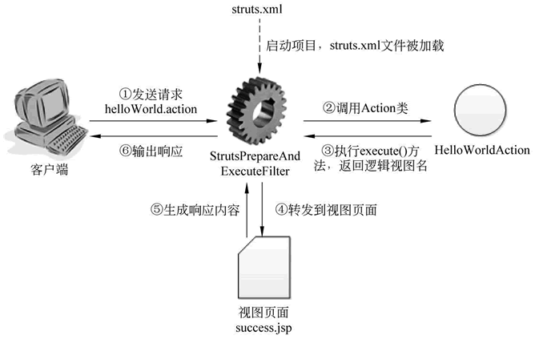

### 总结-WEB-SSH

-------

#### 1. Struts架构

- MVC架构

  - Actions
  - Interceptors
  - OGNL
  - result
  - 视图技术

- 用户请求流程

  

- struts程序结构

  1. 核心

     **StrutsPrepareAndExecuteFilter**

  2. action类

     继承ActionSupport

  3. struts2.xml

     配置对action 类的映射

     ```xml
     <?xml version="1.0" encoding="UTF-8"?>
     <!DOCTYPE struts PUBLIC
             "-//Apache Software Foundation//DTD Struts Configuration 2.3//EN"
             "http://struts.apache.org/dtds/struts-2.3.dtd">
     <struts>
         <!-- Struts2的Action必须放在指定的包空间下定义 -->
         <package name="hello" namespace="/" extends="struts-default">
             <!-- 定义 action，该 action 对应的类为 com.zyw.actions.HelloWorldAction 类-->
             <action name="helloWorld" class="com.zyw.actions.HelloAction">
                 <!-- 定义处理结果和视图资源之间的映射关系 -->
                 <result name="success">/success.jsp</result>
             </action>
         </package>
     </struts>
     ```

     在

     ```jsp
     <a href="${pageContext.request.contextPath }/helloWorld.action">
         第一个 Struts2 程序！
     </a>
     ```

     中点击后，跳转到success页面。

     

- OGNL

  Object - Graph Navigation Language

  对象图导航语言。

  1. OGNL三要素

     表达式、上下文、跟对象。

  2. #

     相当于ActionContext.getContext()

  3. %{}

     告诉中间是OGNL表达式

  4. $

     引入OGNL表达式

  5. 值栈

     为每个请求创建一个新的值栈，

     ActionContext.getContext().getValueStack();

     用于前后台传递数据